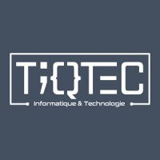
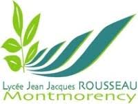
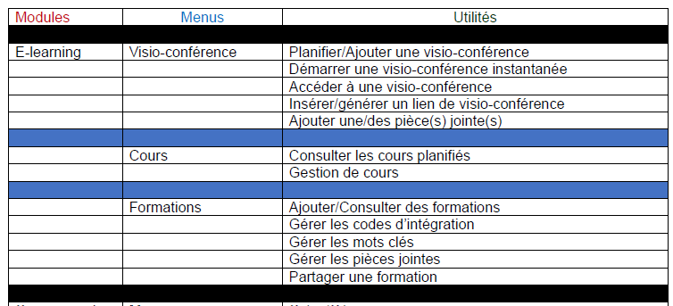
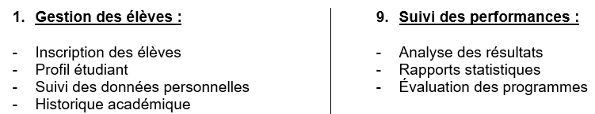
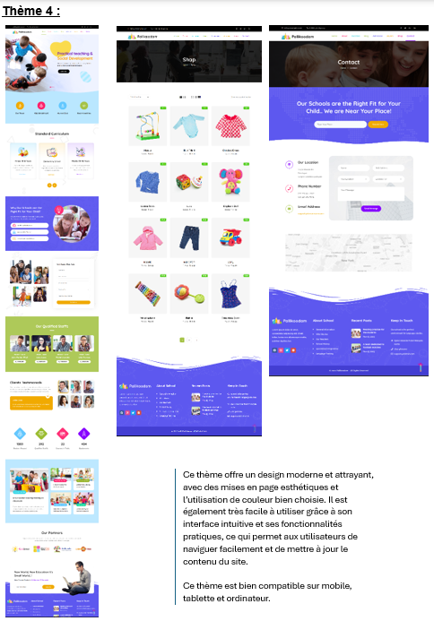
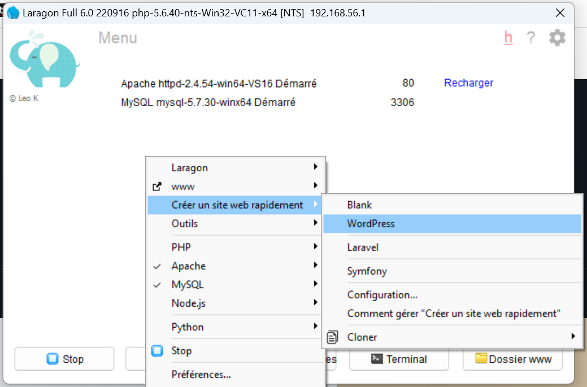
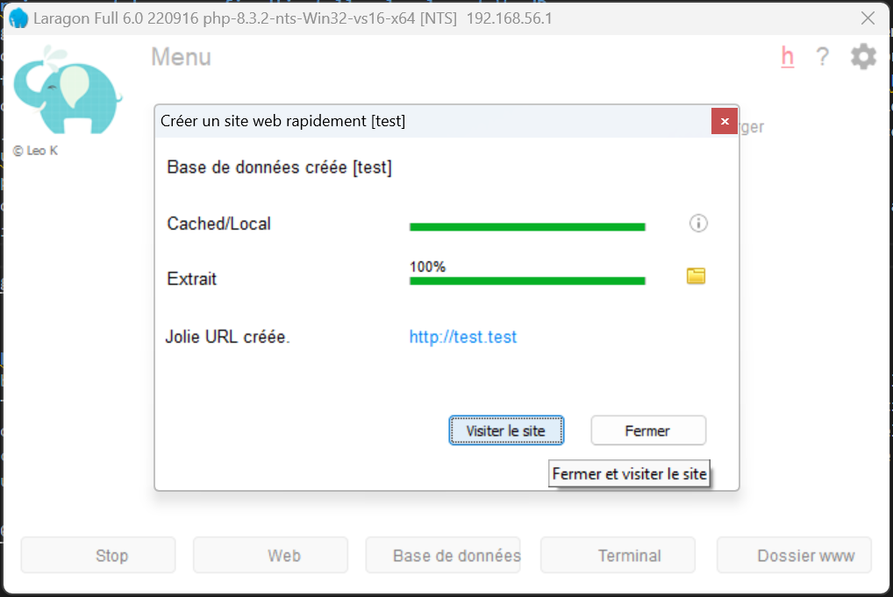
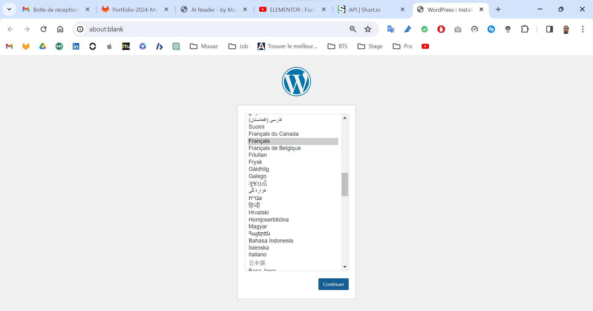
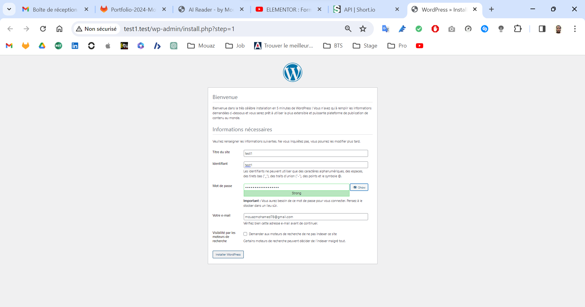
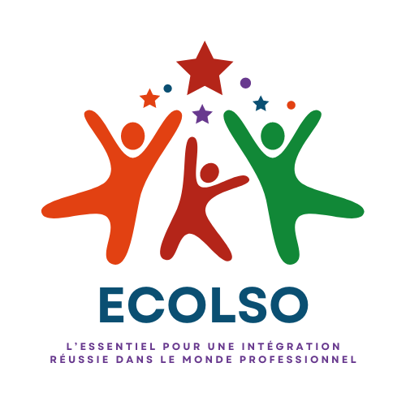

NON FINALISEE !!!

    <h3 align = center><u>COMPTE-RENDU DE STAGE - 2ÈME ANNÉE - BTS SIO OPTION SLAM
    </h3></u>
    <h4>Mouaz MOHAMED
    </h4>
    <h5>Étudiant en deuxième année de BTS SIO option SLAM au lycée Jean Jacques Rousseau à Montmorency
    </h5>
    </h5><strong>Les enseignants référents : Mr. DEBBACHE et Mr. LE MOING</strong>
    </h5>

 

---

 

 

    <h3 align = center>STAGE EFFECTUÉ AU SEIN DE L'ENTREPRISE TIQTEC
    </h3>
    <h4 align = center>Du Lundi 8 Janvier 2024 au Vendredi 16 Février 2024 (6 Semaines)
    </h4>
    <h5 align = center>Sous la supervision du directeur Mr. Rahaman MUJEEBUR
    </h5>

---

    <h3 align = center>REMERCIEMENTS
    </h3>
    <h5 align = center>Je tiens à remercier mes enseignants référents ainsi que Mr. Rahaman MUJEEBUR pour leur bienveillance, leur disponibilité, leur conseils et la confiance qu'ils m'ont accordé tout au long de ce stage. 
    Cet encadrement m'a permis de développer davantage mon autonomie et d'acquérir une précieuse seconde expérience sur le terrain. Je tiens également à remercier toute l'équipe de la société TiqTec qui m'a formé et qui a grandement contribué à ma bonne intégration au sein de l'équipe.
    </h5>

---

### Sommaire :
<u>PARTIE 1 : INTRODUCTION</u> 
<u>PARTIE 2 : PRÉSENTATION ET ÉTUDE DE L'ENTREPRISE TIQTEC</u>  
Portrait et analyse de l'entreprise :
   - Historique et identité de l'entreprise
   - Organisation interne et structure de l'entreprise
   - Analyse du Chiffre d'Affaire

<u>PARTIE 3 : MISSIONS RÉALISÉES</u>
   - Révision et entraînement sur les bases du développement Front-End (HTML/CSS et JavaScript) et du développement Back-End (PHP et SQL)
   - Réalisation de deux projets personnels : Sites Web développés en HTML/CSS et JavaScript
   - Réalisation d'un tableau comprenant toutes les fonctionnalités de tous les modules de l'application MyScol de TiqTec
   - Simplification du tableau par les fonctionnalités principales de l'application MyScol
   - Recherche de maquettes de sites Web compatibles WordPress et Elementor pour un client de TiqTec en fonction de ses besoins
   - Création d'un logo pour Ecolso, une marque blanche de MyScol

<u>PARTIE 4 : CONCLUSION

---

<h3 align = center>PARTIE 1 : INTRODUCTION
</h3>

Je m'appelle Mouaz MOHAMED, étudiant en deuxième année de BTS SIO option SLAM au lycée Jean Jacques Rousseau à Montmorency. Dans le cadre de mon cursus scolaire, j'ai effectué un stage d'une durée de 6 semaines, du Lundi 8 Janvier 2024 au Vendredi 16 Février 2024, dans l'entreprise TiqTec, située au Pépinière d'entreprise de La Courneuve - La Miel, au Centre Commercial La Tour à La Courneuve.  
<u>L'objectif de ce stage était double :</u>  
- Une occasion de mettre en pratique les connaissances théoriques acquises durant mes deux années de mon cursus, ce qui m'a donc permis d'avoir une très bonne opportunité de s'intégrer et de redécouvrir le monde de l'entreprise et du travail.
- Cela m'a également permis d'acquérir une seconde expérience concrète et précieuse pour mon développement professionnel et personnel.  

Ce compte-rendu de stage a pour objetif de partager mon expérience au sein de TiqTec en décrivant les missions qui m'ont été confiées, les compétences que j'ai développées, ainsi que les enseignements que j'ai pu tirer de cette expérience dans le monde professionnel.

---

   <h3 align = center>PARTIE 2 : PRÉSENTATION ET ÉTUDE DE L'ENTREPRISE TIQTEC
   </h3>
   <u>Historique et identité de l'entreprise :</u> TiqTec est une Petite-Moyenne Entreprise (PME) créée le 15 Septembre 2018 à La Courneuve, sous la forme juridique SAS (Société par Actions Simplifiée) pour sa souplesse, flexibilité et liberté d'organisation. La société a été fondée par Mr. Rahaman MUJEEBUR et Mr. Mehdi CHAABANE. TiqTec est une société de services Web et de logiciels axée principalement sur le développement Web, le développement de logiciels, la conception Web, graphique et les services de référencement. Ils travaillent également sur une solution qui leur tiennent à coeur : MyScol. C'est un logiciel tout en un pour piloter la gestion quotidienne des établissements scolaire, étant concurrent direct à Pronote.
   TiqTec est situé dans la Pépinière La Courneuve - La Miel, au Centre Commercial La Tour à La Courneuve.

  

---

<h3 align = center>PARTIE 3 : MISSIONS RÉALISÉES</h3>
Durant mon stage, mes tâches principales étaient de développer des sites Web en HTML/CSS et JavaScript, ainsi qu'avec WordPress en l'installant localement via Laragon. 

#### Révision et entraînement sur les bases du développement Front-End (HTML/CSS et JavaScript) et du développement Back-End (PHP et SQL)
Durant la première semaine de stage, j'ai été amené à réviser et à s'entraîner sur les bases du développement Front-End qui sont le HTML/CSS et JavaScript, ainsi que sur les bases du développement Back-End qui sont le PHP et SQL via la plateforme [W3Schools](https://www.w3schools.com/). La fin de semaine, j'ai effectué un Quiz réalisé par mon directeur de stage Mr. Rahaman MUJEEBUR afin de tester mes connaissances.
  

#### Réalisation de deux projets personnels : Sites Web développés en HTML/CSS et JavaScript
Lors de l'entraînement sur les bases du développement Front-End et Back-End durant la première semaine de stage, j'ai réalisé deux projets personnels qui sont :
- [AI Reader by Mouaz](https://ai-reader-by-mouaz.onrender.com) (Veuillez accéder à mon site sur ordinateur) : Site Web permettant de faire lire à voix haute par l'IA un texte que l'on a écrit avec un choix multiple de voix grâce à une API. Vous pouvez consulter le compte-rendu de ce site via [mon portfolio GitLab](https://gitlab.com/mouaz-portfolio/ia-reader).
- [Password Generator by Mouaz](https://password-generator-by-mouaz.onrender.com/) : Site Web permettant de générer des mots de passe robustes de 16 caractères et pouvant ainsi les copier afin de les réutiliser ailleurs. Vous pouvez consulter le compte-rendu de ce site via [mon portfolio GitLab](https://gitlab.com/mouaz-portfolio/pwd-gen)
  

#### Réalisation d'un tableau comprenant toutes les fonctionnalités de tous les modules de l'application MyScol de TiqTec
Duarant la deuxième semaine de stage, le directeur de stage m'a confié les accès de démo pour l'application Web MyScol de TiqTec afin de prendre conscience de leur application en parcourant toutes ses fonctionnalités et tous ses modules. Par la suite, je devais faire un tableau comprenant toutes les fonctionnalités de tous les modules de l'application MyScol. 
Voici un extrait du tableau :
 

  

#### Simplification du tableau par les fonctionnalités principales de l'application MyScol
Après avoir fait le tableau présenté ci-dessus, j'ai été amené à synthétiser tout ce tableau en les triant par fonction principales et non par modules. 
Voici un extrait de la liste :
 

  

#### Recherche de maquettes de sites Web compatibles WordPress et Elementor pour un client de TiqTec en fonction de ses besoins
Durant la troisième semaine de stage, j'ai été amené à rechercher des maquettes de sites Web à partir du site [Themeforest](https://themeforest.net/) (qui propose des maquettes de sites internet) pour un client de TiqTec en fonction de ses besoins et attentes. 
Le client est une école élémentaire privée qui se nomme La Plume Bleue, situé à Villefranche-sur-Saône. 
A partir du site proposant des maquettes, je devais répondre aux besoins du client qui sont :
- Design moderne, d'actualité et qui fait jeune
- Compatibilité avec WordPress 6.2 au minimum
- Compatibilité avec Elementor (extension WordPress)
- La maquette proposé dans le site doit avoir une bonne documentation, un très bon support et des très bon avis

 Voici un extrait d'une maquette :
 

  

#### Installation de l'environnement Laragon afin d'installer localement WordPress
Je devais installer Laragon qui est un outil tout-en-un comprenant tous les outils nécessaires pour le développement Web comme le serveur Web HTTP Apache, PHP, l'outil d'administration HeidiSQL (on peut installer PhpMyAdmin si on le souhaite) ou encore MySQL. Je peux installer et basculer entre les versions de PHP ou encore choisir soit HeidiSQL, soit PhpMyAdmin, soit les deux. 
Pour installer des versions spécifiques de PHP et de MySQL, ainsi que l'utilisation de PhpMyAdmin au lieu de HeidiSQL (qui est installé par défaut) dans Laragon, il faut les installer sur l'ordinateur à partir des sites Web officiels de ces derniers, puis les placer dans le dossier :
- __laragon/bin/php__ pour la version spécifique de PHP en ayant extrait le dossier
- __laragon/bin/mysql__ pour la version spécifique de MySQL en ayant extrait le dossier
- __laragon/etc/apps__ pour l'utilisation de PhpMyAdmin au lieu de HeidiSQL (ou pour l'utilisation des deux) en ayant extrait le dossier  

Par la suite, je devais installer WordPress localement en ayant suivi ces étapes :
- Faire un __clique-droit__, par la suite cliquer sur __Créer un site web rapidement__, puis sur __WordPress__  
  
- Attendre que l'installation se termine et cliquer sur __Visiter le site__  
  
- Ensuite, je configure mon site WordPress et enfin tout est prêt ! 
 
 
 

#### Création d'un logo pour Ecolso, une marque blanche de MyScol
Après avoir répondu aux besoins de l'école La Plume Bleue, je devais répondre aux besoins de mon directeur pour la future marque blanche Ecolso appertenant à TiqTec qui sera destiné à l'IFPC (Institut de Formation Professionnelle et Continue en Gestion), situé en Afrique. Ecolso est une application strictement identique à l'application MyScol, il y a juste le nom et l'identité visuelle choisi par l'IFPC qui change par rapport à MyScol. Je devais créer des logos à partir de Canva et les proposer à mon directeur afin de les vérifier et d'en choisir un qui sera le futur logo de Ecolso destiné à l'IFPC. 
Voici un extrait de logo Ecolso : 

---

<h3 align = center>PARTIE 4 : CONCLUSION</h3> 
Ce stage de deuxième année de BTS SIO option SLAM chez TiqTec a été une expérience enrichissante à la fois sur le plan professionnel et personnel. J'ai eu l'opportunité de redécouvrir le fonctionnement d'une PME et de m'immerger une seconde fois dans le monde de l'entreprise. Cette expérience m'a permis de développer mes compétences sur le développement Web à travers toutes les tâches réalisées durant tout ce stage, y compris le développemnt Web en HTML/CSS, PHP, SQL, JavaScript, ainsi que Laragon, répondre aux besoins des clients, Elementor, WordPress. J'ai également appris l'importance du travail en équipe au sein de l'entreprise. Ce stage m'a également permis d'améliorer mon autonomie, ma rigueur, mon organisation et ma gestion du temps. Je suis reconnaissant envers toute l'équipe de TiqTec qui m'ont accompagné tout au long de ce stage. Ce stage m'a redonné un aperçu concret du monde professionnel et m'a préparé à relever de nouveaux défis avec confiance et détermination.